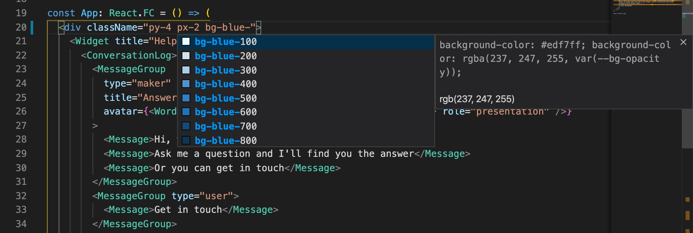

# Garden Design Tokens [![npm version][npm version badge]][npm version link] [![Build Status][build status badge]][build status link] [![Dependency Status][dependency status badge]][dependency status link]<!-- markdownlint-disable -->

<!-- markdownlint-enable -->

[npm version badge]: https://flat.badgen.net/npm/v/@zendeskgarden/tailwindcss
[npm version link]: https://www.npmjs.com/package/@zendeskgarden/tailwindcss
[build status badge]: https://flat.badgen.net/circleci/github/zendeskgarden/tailwindcss/main?label=build
[build status link]: https://circleci.com/gh/zendeskgarden/tailwindcss/tree/main
[dependency status badge]: https://flat.badgen.net/david/dev/zendeskgarden/tailwindcss?label=dependencies
[dependency status link]: https://david-dm.org/zendeskgarden/tailwindcss?type=dev

> :seedling: Garden is the design system by Zendesk

A [Tailwind CSS](https://tailwindcss.com/) plugin for generating CSS based on the
[Garden theme object](https://garden.zendesk.com/components/theme-object).

## Installation

```sh
npm install --save-dev @zendeskgarden/tailwindcss
```

## Usage

Add the plugin to your `tailwind.config.js`:

```js
// tailwind.config.js
module.exports = {
  plugins: [require('@zendeskgarden/tailwindcss')]
};
```

### Utility Classes

Apply Garden design tokens using
[Tailwind utility classes](https://tailwindcss.com/docs/utility-first).

```html

```

Remove unused CSS using Tailwind's
[purge](https://tailwindcss.com/docs/controlling-file-size#removing-unused-css)
option.

### Class Composition with `@apply`

Tailwind provides several [PostCSS directives](https://tailwindcss.com/docs/functions-and-directives/)
for inserting utility styles into CSS. The [@apply directive](https://tailwindcss.com/docs/functions-and-directives/#apply)
allows consumers to reference a specific utility value. This enables support
for more advanced functionality like [CSS modules](https://github.com/css-modules/css-modules).

```css
.title {
  @apply text-grey-600;
  @apply text-sm;
  @apply px-4;
  @apply font-light;
}
```

### Configuration

The plugin provides an optional `includeBedrock` setting which
can be used to disable Garden's [css-bedrock](https://github.com/zendeskgarden/css-components/tree/main/packages/bedrock#readme)
reset.

```js
// tailwind.config.js
module.exports = {
  plugins: [
    require('@zendeskgarden/tailwindcss')({
      includeBedrock: false // defaults to true
    })
  ]
};
```

### Tooling

The [Tailwind CSS IntelliSense](https://marketplace.visualstudio.com/items?itemName=bradlc.vscode-tailwindcss)
VS Code plugin provides autocomplete, syntax highlighting, and linting
based on your Tailwind config. It is very helpful as the Garden-provided
utilities differ slightly from those shown in the Tailwind documentation.



## Contribution

Thanks for your interest in Garden! Community involvement helps make our
design system fresh and tasty for everyone.

Got issues with what you find here? Please feel free to create an
[issue](https://github.com/zendeskgarden/tailwindcss/issues/new).

Community behavior is benevolently ruled by a [code of
conduct](.github/CODE_OF_CONDUCT.md). Please participate accordingly.

## License

Copyright 2021 Zendesk

Licensed under the [Apache License, Version 2.0](LICENSE.md)
